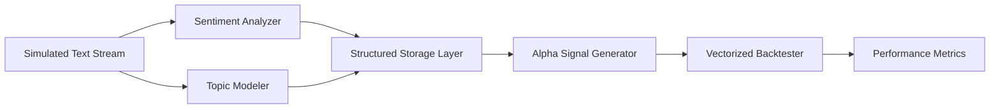

# Stat Arb NLP Engine

An asynchronous research framework for converting unstructured financial text into cross-sectional trading signals for a statistical arbitrage workflow.

The system ingests text streams, scores them with FinBERT, extracts dominant topics with LDA, stores structured observations, transforms them into portfolio weights, and validates the resulting strategy in a vectorized backtest.

## Overview

This repository is a compact end-to-end prototype for NLP-driven alpha research. It is designed to demonstrate the full path from textual signal generation to backtest evaluation with a minimal, inspectable codebase.

The current implementation is synthetic by design:

- Text data is simulated in the ingestion layer.
- Price returns are simulated in the backtester.
- The pipeline is optimized for experimentation, not live execution.

## Key Capabilities

- Asynchronous ingestion loop for streaming textual market events.
- Transformer-based financial sentiment analysis using FinBERT.
- Topic extraction with Latent Dirichlet Allocation.
- Structured signal persistence in an in-memory tabular layer.
- Cross-sectional alpha construction with rolling smoothing and normalization.
- Vectorized backtesting with transaction cost modeling and Sharpe ratio reporting.

## Architecture



### Pipeline Flow

1. `DataIngestionStream` emits timestamped text records for a configured ticker universe.
2. `SentimentAnalyzer` scores each message with FinBERT.
3. `TopicModeler` assigns the dominant latent topic.
4. `StructuredStorageLayer` accumulates the structured observations in a DataFrame-ready store.
5. `AlphaSignalGenerator` pivots sentiment into cross-sectional weights.
6. `VectorizedBacktester` evaluates the strategy with synthetic returns and transaction costs.

## Repository Structure

- [main.py](main.py) - Orchestrates the full async research pipeline.
- [config.py](config.py) - Central configuration for model, universe, and backtest parameters.
- [nlp/sentiment.py](nlp/sentiment.py) - FinBERT-based sentiment scoring.
- [nlp/topics.py](nlp/topics.py) - LDA topic model fitting and inference.
- [pipeline/ingestion.py](pipeline/ingestion.py) - Simulated streaming ingestion source.
- [pipeline/database.py](pipeline/database.py) - In-memory structured storage layer.
- [strategy/execution.py](strategy/execution.py) - Cross-sectional signal generation.
- [strategy/backtester.py](strategy/backtester.py) - Vectorized performance simulation and metrics.

## Requirements

Python 3.10 or newer is recommended.

Core dependencies:

- numpy
- pandas
- scikit-learn
- torch
- transformers

The first run will download the FinBERT checkpoint defined in [config.py](config.py).

## Getting Started

### 1. Create and activate a virtual environment

```bash
python3 -m venv .venv
source .venv/bin/activate
```

### 2. Install dependencies

```bash
pip install -r requirements.txt
```

### 3. Run the pipeline

```bash
python main.py
```

On execution, the application will:

- initialize the NLP components,
- warm up the topic model,
- simulate a text stream across the configured ticker universe,
- generate alpha weights,
- and print backtest metrics to stdout.

## Configuration

Edit [config.py](config.py) to change the research setup.

Available knobs include:

- FinBERT model name.
- Number of LDA topics.
- Start and end dates for the simulated stream.
- Initial capital.
- Transaction cost assumptions.
- Ticker universe.

## Output

The backtester reports a compact summary including:

- analysis period,
- annualized return,
- annualized volatility,
- empirical Sharpe ratio,
- and cumulative return.

## Design Notes

- The storage layer is intentionally in-memory to keep the prototype easy to reason about.
- Sentiment scores are mapped to a continuous range suitable for alpha ranking.
- Weights are normalized to control gross exposure and reduce sensitivity to raw score scale.
- Transaction costs are modeled on absolute turnover to penalize excessive rebalancing.

## Current Limitations

- No real market data integration.
- No persistent database or message bus.
- No portfolio constraints beyond normalization.
- No risk model, hedging logic, or execution simulator.
- No walk-forward validation, calibration split, or out-of-sample evaluation.

## Roadmap

Potential production hardening steps:

- Replace synthetic ingestion with a real-time news or filings feed.
- Persist observations in PostgreSQL, DuckDB, or another analytical store.
- Add feature provenance and experiment tracking.
- Introduce factor and exposure controls.
- Add proper backtest segmentation, slippage, and benchmark comparison.
- Package the pipeline as a CLI or service with structured logging.

## License
